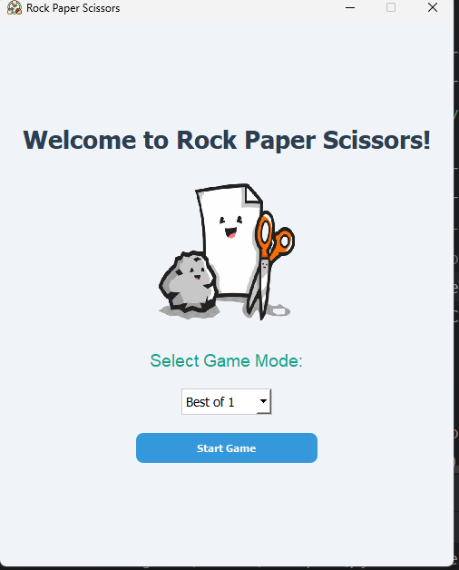
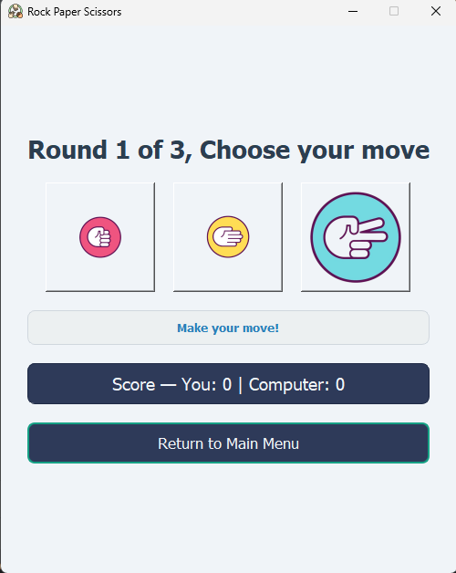
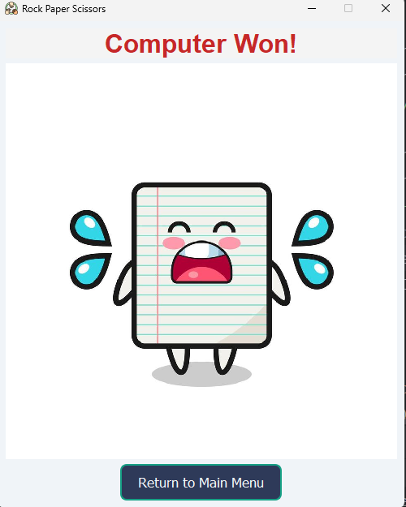

# Rock-Paper-Scissors (GUI)

A simple Rock-Paper-Scissors game with a graphical user interface (GUI) built using Python and PyQt5.  
Players can choose either Rock, Paper, or Scissors, and the computer randomly selects its move from the
3 options.  The game displays the result along with images for each choice.

---

## Features
- Interactive GUI built with PyQt5  
- Computer opponent with random choices  
- Images for Rock, Paper, and Scissors  
- Organized code with separate "logic" and "GUI" files  

---

## Project Structure

RockPaperScissorsProject/  # Local folder
│
├── src/
│   ├── rps_gui.py          # GUI implementation
│   └── rps_logic.py        # Game logic
│
├── images/                 # Game images
│   ├── rock-removebg-preview.png
│   ├── paper-removebg-preview.png
│   ├── scissors-removebg-preview.png
│   ├── rps.png                   # Window icon
│   ├── titleimage-removebg-preview.png
│   └── trophy-removebg-preview.png
│
├── requirements.txt        # Python dependencies
├── README.md               # Project documentation
├── LICENSE                 # License file
└── .gitignore              # Files ignored by Git

---

## Requirements
- Python 3.8+  
- PyQt5  


Install dependencies with:

```bash
pip install -r requirements.txt
```

---

## How to Run

1. Clone the repository:
   
   ```bash
   git clone https://github.com/yourusername/rock-paper-scissors.git
   cd rock-paper-scissors
   ```

2. Install dependencies:

   ```bash
   pip install -r requirements.txt
   ```

3. Run the game:

   ```bash
   python src/rps_gui.py
   ```

---

## Screenshots

### Main Menu


### Game Screen


### Result Screen


---

## License

This project is licensed under the MIT License – see the LICENSE
file for details.
